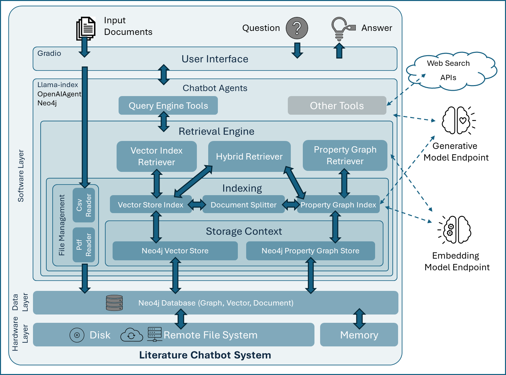

# Literature Chatbot

## Overview

The **Literature Chatbot** is a retrieval-based chatbot system that allows users to upload documents (PDFs, CSVs) and interact with different retrieval agents (vector, graph, or hybrid vector-graph) to extract information from the indexed files. It leverages both vector-based and graph-based retrieval methods to answer user queries and offers a customizable user interface for configuring the retrieval parameters.

## Rules provided in the System Message
The chatbot should follow these rules:

1. The main goal is to provide accurate answers based on the given instructions and context.
2. If the page number is available in the metadata, the chatbot includes the page number as an inline citation for each piece of information provided.
3. The chatbot always retrieves information from the query engine, even if the question is repeated and the answer is already in its memory.
4. If a question does not match the provided context or is outside the scope of the document, the chatbot does not provide answers from its past knowledge. Instead, it advises the user that the requested information is not available in the provided documents.

## Query Engines
The chatbot has different query engines for different types of indexing:

- **Vector Query Engine:** This engine is used for vector-based indexing. It retrieves relevant information based on similarity scores.
- **Property Graph Query Engine:** This engine is used for graph-based indexing. It retrieves information based on the context and relationships between entities in the documents.
- **Hybrid Query Engine:** This engine combines the vector and property graph retrievers to provide a hybrid approach for retrieving information.

The chatbot can be configured to use different query engines based on the user's needs. It also allows for updating the retrieval parameters such as the number of top results to retrieve, the maximum number of synonyms to search, the graph path depth, and the minimum relevance score for references.


## System Architecture




The **Retrieval-Augmented Generation (RAG) pipeline** integrates both vector and property graph-based search mechanisms. Here’s a detailed breakdown of the components:

### Input Layer
- **Document Ingestion**: The system supports various document formats, such as CSV and PDF, that are ingested via a **Simple Directory Reader**.
    - **CustomCSVReader**, extends the BaseReader and is used to load and process data from CSV files into a list of Document objects. Each row in the CSV file is treated as a separate document, where the Abstract column's content becomes the document's text, and other columns like Title, Source, and URL are used to construct metadata, including a citation string. The citation is added to the node metadata.
    - **CustomPDFReader** is used to load and process data from PDF files. It extends the llama_index.readers.file.docs.base.PDFReader with a ability to construct a citation string from the contents of the first page of the PDF article using an LLM. The citation is added to the node metadata.
    - **Note**: Other document types can be ingested too. However, the citation strings will not be available in the metadata.
- **Document Ingestion Parameters**: 
    - **Static Chunking**: `SentenceSplitter` was used for static chunking with default parameters of `chunk_size = 512` and `chunk_overlap = 50`.
    - **Semantic Chunking** `CustomSemanticSplitterNodeParser` was implemented by extending `llama_index.core.node_parser.SemanticSplitterNodeParser`. Parameters `buffer_size` and `breakpoint_percentile_threshold` were set to 1 and 95 respectively by default. A simple `SentenceSplitter` was applied to the resulting chunks to make sure the chunk sizes do not exceed the `chunk_size` parameter.
    - **Note**: Text chunking method does not have a significant impact on the performance of a graph RAG. Because graph RAG captures triplets from text and does not rely on the text directly. Number of triplets extracted per chunk (**`maxPathsPerChunk`**), however, is very consequential for models performance. This number has a direct relationship with the richness of the output knowledge graph. However, given this is a very costly operation (performed by LLM calls), choosing a number that provides a balance between model performance and graph extraction cost becomes crucial. The prototype uses 10 as the default value.

### User Interaction
- **User Interface (Gradio)**: A Gradio-based UI allows users to upload documents, select a retrieval engine and confugrations, ask questions, and receive answers. Gradio serves as the front end for user interaction.

### Agents with Query Handling Tools
- **Chatbot Agents**: `OpenAIAgent` is used as the base class for the chatbot agents. 
- **Query Engine Tools**: The agent uses these tools to handle the user’s query by interacting with the database.
- **Other Tools**: Additional tools like web search or other APIs may assist in answering the user's question. Such tools are not implemented in this prototype.

### Retrieval Engine
- **Hybrid Retriever**: A central part of the system that combines two types of retrieval methods:
  - **Vector Index Retriever**: Uses a vector-based search to retrieve information from embeddings.
  - **Property Graph Retriever**: Leverages graph-based search from property graphs.

### Index Structures
- **Vector Store Index**: `VectorStoreIndex` holds vectors (embeddings) created from the input documents, which are used by the Vector Index Retriever.
- **Property Graph Index**: `PropertyGraphIndex` stores knowledge graph representations of the input data for graph-based querying.

### Storage Context
- **Neo4j Vector Store**: A Neo4j database stores vectors.
- **Neo4j Property Graph Store**: Stores property graphs in Neo4j for graph-based queries.

### Storage Layer
- **Memory**: Provides fast access to frequently used data.
- **Disk** & **Remote File System**: Persistent storage options for input data, vectors, and graphs.

### Model Integration
- **Embedding Model Endpoint**: Embeddings of document nodes and graph triplets are generated and stored using this endpoint. The embeddings should be created using an embedding model that is compatible with the LLM used to synthesize answers. OpenAI's `text-embedding-ada-002` was used as the embedding model.
- **Generative Model Endpoint**: Used to generate responses based on the retrieved data, possibly through an LLM like OpenAI’s models. The LLM used in the prototype is OpenAI's `GPT-4o` or `GPT-3.5-Turbo`. Support for other models can be added through the `Config.cfg` file. 

### Data Flow
The system starts by ingesting documents, storing them in a Neo4j database, and creating index structures (vector and property graph). When a user asks a question, the **retrieval engine** performs a hybrid search across both vector and graph indices, fetching the most relevant information. The **generative model** then uses this retrieved data to generate a coherent answer for the user, which is displayed via the Gradio interface.


## Dependencies
This project requires several Python libraries to function properly. To install the necessary dependencies, run the following command:
```bash
pip install -r requirements.txt
```

The `requirements.txt` file should include the following libraries:
```txt
openai==1.37.1
llama-index==0.10.58
llama-index-llms-ollama==0.2.2
ipython==8.26.0
llama-index-llms-azure-openai==0.1.10
llama-index-embeddings-azure-openai==0.1.11
llama-index-graph-stores-neo4j==0.2.9
llama-index-vector-stores-neo4jvector==0.1.6
networkx==3.3
pyvis==0.3.2
gradio
neo4j==5.23.0
ipykernel==6.29.5
docker==7.1.0
```

## Configuration
The `Config.cfg` file is used to store configurable parameters for the chatbot system. Below is the structure of the `Config.cfg` file and what each section represents:

```cfg
[azure-openai]
azure_endpoint = https://***************.openai.azure.com/
api_key = ***************

[embedding-model]
model=text-embedding-ada-002
deployment_name=text-embedding-ada-002-2
api_version=2023-05-15

[gpt35turbo]
model=gpt-35-turbo
deployment_name=gpt-35-turbo-deployment
api_version=2024-05-01-preview

[gpt4o]
model=gpt-4o
deployment_name=gpt-4o-deployment
api_version=2024-02-15-preview


[neo4j]
username = ***************
password = ***************
url = bolt://localhost:7687
embedDim = 1536
containerName = ***************

[dir-structure]
inputDir = ./input/selected
logDir = ./logs/
logFile = processing_log.txt
dataPath = ./neo4j_vol1/data
pluginsPath = ./neo4j_vol1/plugins

[general]
appVersion = 0.3.0
# Whether to index documents in `inputDir` before launching the chatbot UI
forceReindex = False
# Whether to log INFO and WARNING messages
enableLogging = True
# Whether to show low level progress bars, if set to False, only high level progress bar will be rendered. Only shown in the terminal.
showProgress = True

[indices]
allIndices = vector, graph, graph+vector
# The indices that will be exposed in the UI, the first one is always selected by default
# Only the exposed indices will be built by the `ChatbotAgents.appendIndex()` method: 
# example: `availableIndices = vector,` builds and exposes only the vector index
availableIndices = vector, graph, graph+vector
# PropertyGraphIndex parameters
maxPathsPerChunk = 10

[retriever]
# Default retriever parameters - These can be adjusted in the UI
vectorTopK = 10
contextTopK = 2
maxSynonyms = 10
pathDepth = 1
cutoffScore = 0.9

[nodeparser]
# Node parser approach, can be either `static` or `semantic`
nodeParserType = semantic
# Number of documents to process at a time, larger values may lead to hitting the embedding API rate limit
batchSize = 1
# Number of tokens to include in each chunk
chunk_size = 512
# The overlap between subsequent chunks
chunk_overlap = 50

# The following are applicable only to the Semantic Splitter
# Default = 1, Adjust buffer size as needed
bufferSize = 1
# Default = 95, lower values result in too many small chunks
breakpointPercentileThreshold = 95
```

## Main Classes
The following are the main functions used in the `LiteratureChatbot.py` file, their signatures, and usage examples.

### 1. **FileManagement**
```python
class FileManagement:
    """
    This class provide the required file management functionalities.
    """
    def __init__(self,config) -> None:
        """
        Initializes the `FileManagement` object with the provided configuration.
        """

    def getConfigs(self):
        """
        Retrieves the necessary configurations for file management from the global configuration.
        """
    
    def buildFolders(self):
        """
        Creates the necessary folders for file management.
        """
        
    def append(self,files):
        """
        Copies the provided files to the input directory and returns a message indicating the successful upload.
        """

    def upload(self,files):
        """
        Clears the existing files and uploads the provided files.
        """

    def clear(self):
        """
        Deletes all the files in the input directory.
        """
    def ls(self):
        """
        Returns a list of the names of the uploaded files.
        """
    
    def createDummyFile(self):
        """
        Creates a dummy file in the input directory. This is to avoid failures when creating index from an empty directory.
        """
```

### 2. Storage

```python
class Storage:
    """
    This class is responsible for managing the storage and retrieval of data used by the Literature Chatbot.
    """
    def __init__(self,config) -> None:
        """
        The constructor method initializes the object and sets the configuration parameters. It takes a `config` object as a parameter. Inside the constructor, it initializes the Neo4jPropertyGraphStore and Neo4jVectorStore objects for storing property graph data and vector data respectively. It also sets up the storage context for both graph and vector data.
        """

    def getConfigs(self):
        """
        This method retrieves the configuration parameters from the `config` object and assigns them to instance variables. These parameters include the Neo4j database URL, username, password, and the embedding dimension.
        """
    def clear(self):
        """
        This method clears the Neo4j graph database by deleting all nodes and relationships. It uses the provided URL, username, and password to connect to the database and execute a Cypher query to delete all nodes and relationships.
        """
```

### 3. Index
```python
class Index:
    """
    This class is responsible for building and managing the indices used for searching and retrieving information from the uploaded documents.
    """
    def __init__(self,llm,config) -> None:
        """
        The constructor method initializes the attributes of the class, such as the LLMSynonymRetriever object, configuration object, storage, vectorIndex, pgIndex, kgExtractors, and fileManager.
        """
    
    def getConfigs(self):
        """
        This method retrieves the configuration values from the config object and assigns them to the corresponding attributes of the class.
        """

    def _buildVector(self, documents, batchSize=4):
        """
        This method builds the vector index using the provided documents. It iterates over the documents in batches and calls the `from_documents` method of the VectorStoreIndex class to build the vector index.
        """
    
    def _buildPg(self, documents, batchSize=4):
        """
        This method builds the property graph index using the provided documents. It calls the `from_documents` method of the PropertyGraphIndex class to build the property graph index.
        """

    def _build(self, documents, batchSize=4):
        """
        his helper method calls both `_buildVector` and `_buildPg` methods to build both the vector and property graph indices.
        """

    def append(self,inputDocsDir,batchSize=1,indexType='graph+vector'):
        """
        This method adds new documents to the existing indices. It loads the documents from the input directory using the SimpleDirectoryReader class and calls the appropriate method based on the index type to build the corresponding index.
        """
    
    def get(self, indexType='graph+vector'):
        """
        This method retrieves the built indices. It takes the index type as a parameter and returns the corresponding index object(s) based on the index type.
        """
```
### 4. QueryEngine
```python
class QueryEngine:
    """
    This class is responsible for building and managing the query engines used by the Literature Chatbot.
    """

    def __init__(self,llm,embedModel,config) -> None:
        """
        The constructor method initializes the object and sets the configuration parameters. It takes three parameters: `llm`, which is the language model used for generating responses, `embedModel`, which is the embedding model used for calculating text embeddings, and `config`, which is the configuration object that contains various settings for the query engine.
        """

    def getConfigs(self):
        """
        This method retrieves the configuration parameters from the `config` object and assigns them to instance variables. These parameters include the input directory, the top-k value for vector retrieval, the top-k value for graph context retrieval, the maximum number of synonyms, and the path depth. These parameters are used in the building of the query engines.
        """

    def _buildVectorQueryEngine(self, forceReindex=False):
        """
        This method builds a query engine using a vector index. It creates a `VectorIndexRetriever` and a `RetrieverQueryEngine` based on the vector index. If `forceReindex` is set to True, it appends the input documents to the vector index before building the query engine.
        """

    def _buildPgQueryEngine(self, forceReindex=False):
        """
        This method builds a query engine using a property graph index. It creates a `VectorContextRetriever` and an `LLMSynonymRetriever` as sub-retrievers, and a `PGRetriever` based on these sub-retrievers. It also creates a `RetrieverQueryEngine` based on the `PGRetriever`. If `forceReindex` is set to True, it appends the input documents to the property graph index before building the query engine.
        """
        
    def _buildHybridQueryEngine(self):
        """
        This method builds a query engine using a property graph index. It creates a `VectorContextRetriever` and an `LLMSynonymRetriever` as sub-retrievers, and a `PGRetriever` based on these sub-retrievers. It also creates a `RetrieverQueryEngine` based on the `PGRetriever`. If `forceReindex` is set to True, it appends the input documents to the property graph index before building the query engine.
        """
        
    def _buildAll(self, forceReindex=False):
        """
        This method builds all three types of query engines: vector, property graph, and hybrid. It calls the `_buildVectorQueryEngine`, `_buildPgQueryEngine`, and `_buildHybridQueryEngine` methods.
        """
        
    def get(self,indexType = 'vector'):
        """
        This method returns the specified query engine based on the provided index type. It can return the vector query engine, the property graph query engine, or the hybrid query engine. If the index type is not supported, an exception is raised.
        """
        
    def getAll(self):
        """
        This method builds all three types of query engines and returns them.
        """
        
```

### 5. ChatbotAgents
```python
class ChatbotAgents:
    successMsg = 'Chatbot Agents updated successfully!'
    def __init__(self,configPath) -> None:
        """
        Initializes the `ChatbotAgents` object by loading the configuration file and setting up the chatbot agents.
        """
        
    def getConfigs(self):
        """
        retrieves the necessary configurations for the chatbot agents from the global configuration.
        """
        
    def getModelConfigs(self,configPath):
        """
        retrieves the model configurations for the chatbot agents from the global configuration.
        """
        
    def updateQueryEngine(self):
        """
        updates the query engine used by the Literature Chatbot. It rebuilds the query engine based on the updated configuration parameters.
        """
        
    def _buildAll(self):
        """
        builds the necessary components of the chatbot. It creates the agents and tools required for the chatbot to function.
        """
    
    def appendIndex(self,vectorTopK,contextTopK,maxSynonyms,pathDepth,cutoffScore):
        """
        Appends the index of the input documents to the query engine based on the provided parameters. It also rebuilds the query engine and the chatbot agents.
        """

    def getDefault(self):
        """
        Creates a dummy file and returns the default chatbot agent.
        """
        
    def getAll(self, forceReindex=False):
        """
        Returns all the chatbot agents. If `forceReindex` is set to `True`, it appends the index and rebuilds the agents before returning them.
        """
    
    def updateParams(self,vectorTopK,contextTopK,maxSynonyms,pathDepth,cutoffScore):
        """
        Updates the parameters of the chatbot agents based on the provided values. It also updates the query engine.
        """

    def chatbot(self, queryStr, history):
        """
         Takes a user query and a history of previous interactions as input and returns the chatbot's response. It uses the selected chatbot agent to generate the response. Passing the history is not needed since that is captured by the agent's memory. However, the history argument is still needed to be compatible with the Gradio interface component.
        """
    
    def uploadFiles(self,files):
        """
        Uploads the input files to the query engine's file manager.
        """

    def clearFiles(self):
        """
        Clears the input files and the query engine's storage.
        """

    def getFilesList(self):
        """
        Returns a list of the uploaded input files.
        """
    
    def selectAgent(self,indexType):
        """
        Selects the chatbot agent based on the provided index type.
        """

    def selectDefaultAgent(self):
        """
        Selects the default chatbot agent.
        """

    def getSelectedAgent(self):
        """
        Returns the currently selected chatbot agent.
        """
```


## Summary
The **Literature Chatbot** is a versatile and interactive system designed for literature review, data retrieval, and question-answering based on both vector-based and graph-based approaches. With a simple UI, users can upload documents, configure retrieval settings, and interact with the system to extract relevant information from indexed literature.

The code is completely modularized so that the components can be used in other scripts as needed.

By refining the scalability, usability, and security of the system, it can be further optimized for real-world academic and research-based use cases.
